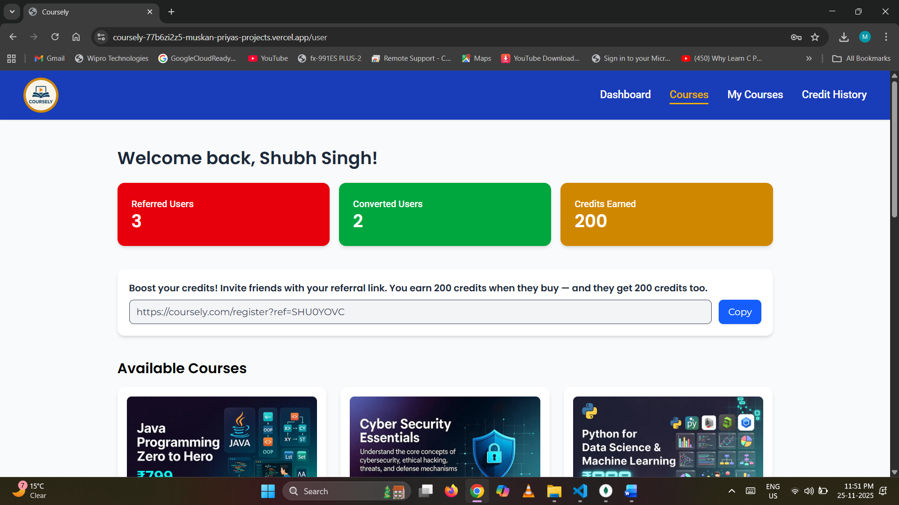

# 🎓 Coursely – Course Selling Platform

<p align="center"> 
     
</p> 
<p align="center"> <strong>A fully modern, responsive, secure, full-stack course selling platform.</strong> </p>

## 📸 Preview Screenshots

<p align="center"> 
     
</p> 
<p align="center"> 
     
</p> 
<p align="center"> 
     
</p>

## ✨ Features

### 👨‍🎓 User Features

- JWT-based login & registration
- View and purchase courses
- Credit-based rewards system
- Credit transaction history
- View purchased courses
- change password
- Protected routes (middleware)

### 🛠 Admin Features

- Create new courses
- Update/Delete courses only if created by that admin
- Manage course inventory

## 🧰 Tech Stack

### Frontend (Vercel)

- Next.js (App Router)
- TypeScript
- Tailwind CSS
- Zustand (state management)
- Axios
- Framer Motion
- Lucide Icons

### Backend (Render)

- Node.js + Express.js
- TypeScript
- MongoDB + Mongoose
- JWT + Bcrypt
- Cookie-based auth

## ⚙️ Setup Instructions

### 1️⃣ Clone the Repository

```bash
git clone https://github.com/MuskanPriyaSingh/Coursely.git
cd coursely
```

### 2️⃣ Backend Setup (Node.js + TypeScript)

```bash
cd backend
npm install
```

Start in development
```bash
npm run dev   # tsc --watch
```

Build
```bash
npm run build   # generates dist folder
```

Start production
```bash
npm start       # node dist/index.js
```

### 3️⃣ Frontend Setup (Next.js)

```bash
cd frontend
npm install
npm run dev
```

## 🔐 Environment Variables

### Backend (.env)
```bash
MONGODB_URI=your_database_uri
PORT=any_port_number_for_localhost
JWT_SECRET=your_jwt_secret_key
CLOUD_NAME=your_cloud_name
API_KEY=your_cloud_api_key
API_SECRET=your_cloud_api_secret_key
FRONTEND_URL=https://your-frontend.vercel.app
NODE_ENV=your_node_environment
```

### Frontend (.env)
```bash
NEXT_PUBLIC_API_URL=https://your-backend.onrender.com/api/v1
```

## 🔗 API Endpoints Overview

### 👨‍🎓 Admin Routes

| Method     |	      Endpoint                     |        Description                     |
|------------|-------------------------------------|----------------------------------------|
| POST       |  /admin/register                    |   Register a new admin                 |
| POST       |  /admin/login                       |   Authenticate and login admin         |
| GET        |  /admin/logout                      |   Logout admin                         |
| POST       |  /admin/forgot-password             |   Change forgot password               |

### 👨‍🎓 User Routes

| Method     |	      Endpoint                     |        Description                     |
|------------|-------------------------------------|----------------------------------------|
| POST       |  /user/register                     |   Register a new user                  |
| POST       |  /user/login                        |   Authenticate and login user          |
| GET        |  /user/logout                       |   Logout user                          |
| POST       |  /user/forgot-password              |   Change forgot password               |
| GET        |  /user/purchases                    |   Fetch user purchased courses         |
| GET        |  /user/referral-details             |   View referral status                 |
| GET        |  /user/credits-history              |   View credit transactions             |
            

### 📚 Course Routes

| Method     |	      Endpoint                     |        Description                        |
|------------|-------------------------------------|-------------------------------------------|
| POST       |  /course/create                     |   Create course (Admin only)              |
| PUT        |  /course/:courseId                  |   Update course (Admin + must be creator) |
| DELETE     |  /course/:courseId                  |   Delete course (Admin + must be creator) |
| GET        |  /course                            |   Get all courses                         |
| GET        |  /course/:courseId                  |   Get course details                      |
| POST       |  /course/purchase/:courseId         |   Purchase a course                       |

## 🏛 Architecture

```bash
coursely/
│── backend/
|   ├── src/
|   |   ├── config/
|   │   ├── controllers/
|   │   ├── middleware/
|   │   ├── models/
|   │   └── routes/
|   └── dist/
|
├── frontend/
|   ├── app/
|   ├── components/
|   ├── lib/
|   │    ├── api.ts (Axios instance)
|   │    ├── store.ts (Zustand store)
|   └── public/
│
└── README.md        
```

## 🧠 Business Logic Explanation

### 🔹 Admin & User Authentication

- JWT created on login
- Stored in HttpOnly cookie
- Used for protected routes
- Middleware validates token on each request

### 🔹 Admin Course Restrictions

Admins can only edit or delete courses created by themselves:
```bash
if (course.creatorId !== req.user.id) {
    return res.status(403).json({ message: "Not authorized" });
}
```

### 🔹 Purchasing Logic

1. User hits /purchase/:courseId
2. Backend checks:
    - Course exists
    - User not already purchased
    - Credit logic (earn/spend)
3. Creates:
    - Purchase record
    - Credit transaction record
4. Sends success response

### 🔹 Credit System

- Every transaction logged
- Earned credits (referrals / first purchase bonus)
- Use credits (in course purchasing)

### 🔹 Zustand Usage

Zustand handles in-page state:
- Logged-in user
- Persisted session state
- Auto-refresh after login/logout
- Prevents prop-drilling across components

## ☁️ Deployment

- **Frontend**: [Vercel](https://coursely-1nwyap5lc-muskan-priyas-projects.vercel.app)
- **Backend**: [Render](https://coursely-q8qo.onrender.com)

## 🏁 Final Notes

Coursely is built to be:
- Scalable
- Secure
- Developer-friendly
- Easy to extend

Possible future upgrades:
- Payment gateway (Razorpay/Stripe)
- Course progress tracking
- Leaderboards & badges


